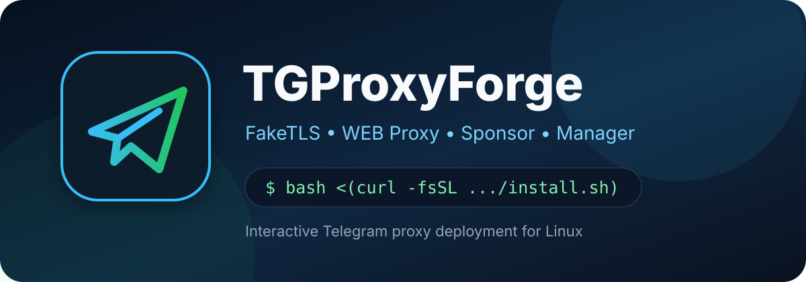
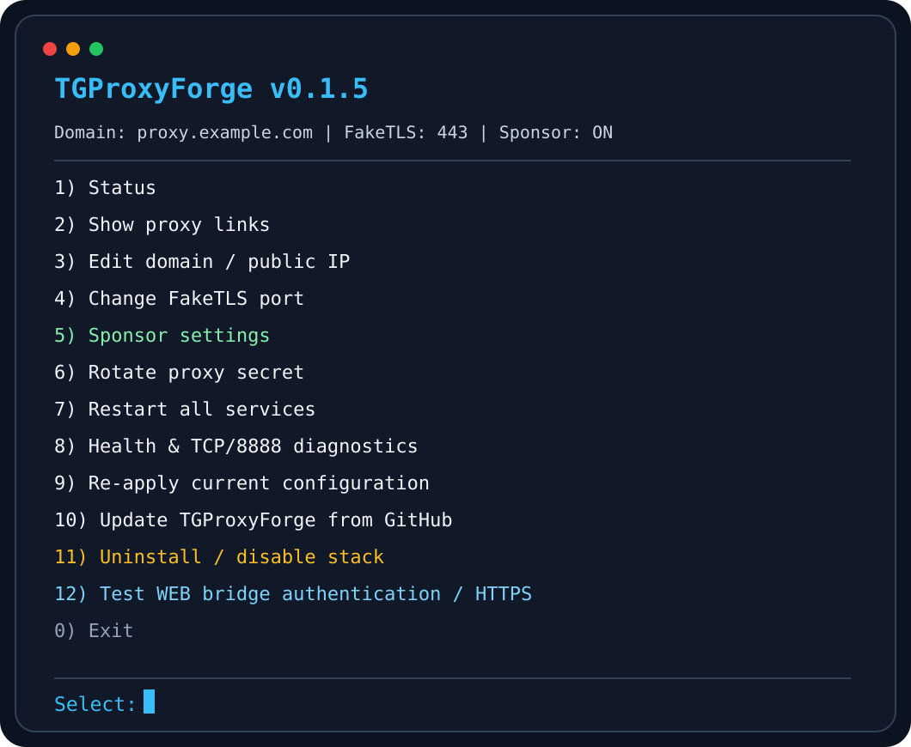
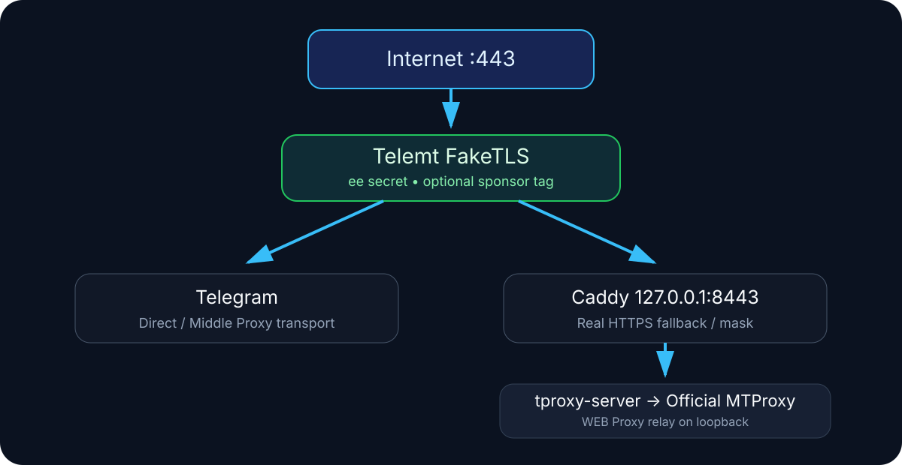

<div align="center">
  
  <h1>TGProxyForge</h1>
  <p><strong>Telegram MTProto FakeTLS &amp; WEB Proxy</strong><br>Automated deployment • Unified management • Sponsor integration</p>
  <p>
    
    
    
  </p>
  <p>
    <a href="#persian">🇮🇷 فارسی</a> •
    <a href="#english">🇬🇧 English</a> •
    <a href="https://t.me/NET_SPOOF">✈️ @NET_SPOOF</a>
  </p>
</div>

---

<div dir="rtl" align="right">

<h2 id="persian">🇮🇷 راهنمای فارسی</h2>

<p><strong>TGProxyForge</strong> ابزار خط فرمانی برای نصب و مدیریت دو سرویس پروکسی تلگرام روی سرور لینوکسی است. پروژه از <a href="https://github.com/telemt/telemt">Telemt</a> برای FakeTLS و از <a href="https://github.com/telegramdesktop/tproxy-server">tproxy-server</a> به‌همراه MTProxy رسمی و Caddy برای WEB Proxy استفاده می‌کند.</p>

<h3>✨ قابلیت‌ها</h3>
<ul>
  <li>راه‌اندازی <strong>MTProto FakeTLS</strong> و تولید لینک اتصال <code>tg://proxy</code></li>
  <li>راه‌اندازی <strong>Telegram WEB Proxy</strong> و تولید لینک <code>tg://webproxy</code></li>
  <li>مدیریت دامنه و IP، پورت FakeTLS، Secret و سرویس‌ها از منوی تعاملی</li>
  <li>پشتیبانی از کانال اسپانسری با Proxy Tag صادرشده از <a href="https://t.me/MTProxyBot">@MTProxyBot</a></li>
  <li>نمایش لینک‌ها، بررسی سلامت سرویس‌ها، تست معتبر WEB Bridge، به‌روزرسانی و غیرفعال‌سازی سرویس‌ها</li>
</ul>

<h3>🚀 نصب سریع</h3>
<p>روی سرور ترجیحاً تازه با <strong>Ubuntu 22.04/24.04 یا Debian 12</strong>، معماری <code>x86_64</code>، دسترسی <code>root</code> و IPv4 عمومی اجرا کنید:</p>
<pre dir="ltr" align="left"><code class="language-bash">bash &lt;(curl -fsSL https://raw.githubusercontent.com/Net-spoof/TGProxyForge/main/install.sh)</code></pre>
<p>بعد از نصب، منوی مدیریت را باز کنید:</p>
<pre dir="ltr" align="left"><code class="language-bash">tgproxy</code></pre>

<h3>🌐 نصب با دامنه و بدون خرید دامنه</h3>
<ul>
  <li><strong>دامنه شخصی:</strong> یک hostname با رکورد A متصل به IP سرور وارد کنید. برای کنترل DNS و پایداری بیشتر توصیه می‌شود.</li>
  <li><strong>بدون دامنه شخصی:</strong> IP عمومی سرور را وارد کنید و در سؤال دامنه <strong>Enter</strong> بزنید. اسکریپت به کمک <a href="https://sslip.io/">sslip.io</a> یک hostname مبتنی بر IP ایجاد می‌کند.</li>
</ul>
<p>در حالت دوم، لینک FakeTLS از <strong>IP مستقیم</strong> استفاده می‌کند، اما WEB Proxy و HTTPS همچنان به hostname و DNS عمومی وابسته‌اند. اگر DNS یا اتصال TCP/443 در شبکه کاربران محدود باشد، این حالت ممکن است قابل‌استفاده نباشد.</p>

<h3>🛠️ دستورات مدیریتی</h3>
<table>
<thead><tr><th align="right">دستور</th><th align="right">عملکرد</th></tr></thead>
<tbody>
<tr><td><code>tgproxy</code></td><td>منوی تعاملی</td></tr>
<tr><td><code>tgproxy status</code></td><td>وضعیت سرویس‌ها و پورت‌های فعال</td></tr>
<tr><td><code>tgproxy links</code></td><td>دریافت لینک FakeTLS و WEB Proxy</td></tr>
<tr><td><code>tgproxy health</code></td><td>بررسی سرویس‌ها، HTTPS، WEB Bridge و مسیر اسپانسر</td></tr>
<tr><td><code>tgproxy web-test</code></td><td>تست احراز هویت WEB Bridge از مسیر داخلی و HTTPS عمومی سرور</td></tr>
<tr><td><code>tgproxy apply</code></td><td>اعمال مجدد تنظیمات و ری‌استارت سرویس‌ها</td></tr>
<tr><td><code>tgproxy update</code></td><td>آپدیت مدیریت از GitHub</td></tr>
<tr><td><code>tgproxy uninstall</code></td><td>غیرفعال‌کردن سرویس‌ها و حذف ابزار مدیریت</td></tr>
</tbody>
</table>
<p><strong>توجه:</strong> حذف نصب فعلی Caddy را هم متوقف می‌کند و برخی فایل‌های سرویس‌های وابسته و بکاپ‌ها را برای بازیابی نگه می‌دارد. اگر سایت دیگری روی Caddy دارید، پیش از حذف بررسی کنید.</p>

<div align="center"></div>

<h3>🏗️ معماری</h3>
<p>در حالت پیش‌فرض، Telemt روی پورت ۴۴۳ عمومی قرار دارد. ترافیک FakeTLS را مدیریت کرده و درخواست‌های HTTPS معمولی را به Caddy روی <code>127.0.0.1:8443</code> هدایت می‌کند. Caddy درخواست‌ها را به WEB relay داخلی می‌رساند و MTProxy رسمی backend آن است.</p>
<div align="center"></div>

<h3>📣 راه‌اندازی کانال اسپانسری</h3>
<ol>
<li>از منوی مدیریت، بخش Sponsor را فعال کنید.</li>
<li>در <a href="https://t.me/MTProxyBot">@MTProxyBot</a> با IP، پورت FakeTLS و Base Secret پروکسی را ثبت کنید.</li>
<li>Proxy Tag سی‌ودو کاراکتری را در TGProxyForge وارد کنید.</li>
<li>با گزینه <strong>Set promotion</strong> در ربات، کانال عمومی خود را مشخص کنید.</li>
</ol>
<p>برای نمایش اسپانسر، آماده‌بودن واقعی Telegram Middle Proxy اهمیت دارد؛ <code>tgproxy health</code> مسیر اتصال را گزارش می‌کند. صرف بازبودن TCP/8888 تضمین فعال‌بودن اسپانسر نیست.</p>

<h3>🔐 پورت‌ها و فایل‌های مهم</h3>
<ul>
<li><code>22/tcp</code>: دسترسی SSH</li>
<li><code>80/tcp</code>: صدور و تمدید گواهی HTTPS</li>
<li><code>443/tcp</code>: FakeTLS و مسیر HTTPS پیش‌فرض</li>
<li>پورت TCP جداگانه فقط در صورت انتخاب پورت FakeTLS غیر از ۴۴۳</li>
<li><code>8888/tcp</code> خروجی: ممکن است برای ارتباط با Middle-End تلگرام لازم باشد</li>
</ul>
<p>پورت‌های داخلی مانند <code>2398</code>، <code>9091</code> و پورت‌های مدیریت WEB نباید عمومی شوند. فایل <code>/etc/tgproxyforge/config.env</code> شامل اطلاعات حساس و Secret است و نباید منتشر شود.</p>

<h3>🔎 عیب‌یابی</h3>
<p>فرمان <code>tgproxy web-test</code> بررسی می‌کند Bridge روی خود سرور از دو مسیر داخلی و HTTPS پاسخ احرازشده می‌دهد؛ این تست به‌تنهایی اتصال از موبایل، DNS اپراتور یا عملکرد کلاینت را تأیید نمی‌کند.</p>
<p>برای بررسی خطاها: <a href="docs/TROUBLESHOOTING.fa.md"><strong>راهنمای عیب‌یابی فارسی</strong></a></p>

<h3>📌 سازگاری و محدودیت‌ها</h3>
<p><strong>WEB Proxy</strong> بر پایه پیاده‌سازی <a href="https://github.com/telegramdesktop/tproxy-server">tproxy-server</a> است که توسعه‌دهنده آن را در مستندات رسمی به‌عنوان <strong>Proof of Concept</strong> معرفی کرده است. استفاده از WEB Proxy به نسخه‌ای از کلاینت تلگرام نیاز دارد که WEB transport را پشتیبانی کند. تست موفق <code>tgproxy web-test</code> فقط عملکرد Bridge از داخل سرور را تأیید می‌کند و به معنی اتصال تضمینی در شبکه یا اپلیکیشن کاربران نیست.</p>
<p>در حالت نصب بدون دامنه شخصی، hostname رایگان <code>sslip.io</code> برای WEB Proxy به DNS عمومی و دسترسی HTTPS نیاز دارد. بعضی شبکه‌ها ممکن است این hostname یا اتصال به IP سرور را محدود کنند.</p>

<p>📨 ارتباط: <a href="https://t.me/NET_SPOOF"><strong>@NET_SPOOF</strong></a></p>

</div>

---

## 🇬🇧 English guide <a id="english"></a>

**TGProxyForge** is an interactive Bash installer and management CLI for Telegram MTProto FakeTLS and a **WEB Proxy** stack on a Linux server.

### Components and features

- **MTProto FakeTLS** powered by [Telemt](https://github.com/telemt/telemt).
- **Telegram WEB Proxy** powered by [tproxy-server](https://github.com/telegramdesktop/tproxy-server), [official MTProxy](https://github.com/TelegramMessenger/MTProxy) and [Caddy](https://github.com/caddyserver/caddy).
- Optional promoted-channel integration through [@MTProxyBot](https://t.me/MTProxyBot).
- Interactive management of public IP, hostname, FakeTLS port, secrets, proxy links and service lifecycle.
- Diagnostics for TLS, Telemt, WEB Bridge authentication and Middle Proxy routing.

### Quick installation

Requirements: **Ubuntu 22.04/24.04** or **Debian 12**, `x86_64`, root access and a public IPv4 address. A clean, dedicated server is recommended because installation manages Caddy and proxy services.

```bash
bash <(curl -fsSL https://raw.githubusercontent.com/Net-spoof/TGProxyForge/main/install.sh)
```

```bash
tgproxy
```

**Custom domain:** Set an A record to the server IP and enter the hostname during setup.

**Without an owned domain:** Enter the public IPv4, then press Enter at the domain prompt. TGProxyForge creates a hostname through [sslip.io](https://sslip.io/). FakeTLS share links connect to the server IP, but WEB Proxy still relies on DNS, HTTPS certificates and external network reachability. This mode may fail on networks that block the auto-hostname or the destination IP.

### Command reference

| Command | Action |
| --- | --- |
| `tgproxy` | Open interactive manager |
| `tgproxy status` | Inspect service state and listeners |
| `tgproxy links` | Print FakeTLS and WEB Proxy links |
| `tgproxy health` | Check service health, WEB Bridge and sponsor routing |
| `tgproxy web-test` | Verify authenticated WEB Bridge on local relay and public HTTPS |
| `tgproxy apply` | Re-apply saved config and restart services |
| `tgproxy update` | Update TGProxyForge from GitHub |
| `tgproxy uninstall` | Disable proxy stack and remove the manager |

**Uninstall warning:** The current uninstaller stops Caddy and retains selected upstream binaries/configs and recovery backups; check for other services using Caddy before running it.

### Network and sponsor

Allow inbound TCP **22** (SSH), **80** (ACME/HTTP) and **443** (default FakeTLS/HTTPS). Open another inbound TCP port only when configured for FakeTLS. Sponsor connectivity may require outbound TCP **8888** to Telegram Middle-End infrastructure. Internal backend and admin ports must remain private.

To configure a promoted channel, register the proxy public IP, port and **base secret** with [@MTProxyBot](https://t.me/MTProxyBot); copy its 32-character Proxy Tag into TGProxyForge and select **Set promotion** for the public channel. Telegram controls whether and when promotions appear.

### Important files

```text
/etc/tgproxyforge/config.env        # settings and secret
/etc/telemt/telemt.toml             # Telemt
/etc/tproxy-server/config.json      # WEB relay
/etc/tproxy-server/profiles.json    # WEB profiles
/etc/mtproxy/mtproxy.env            # official MTProxy
/etc/caddy/Caddyfile                # HTTPS routing
/opt/tgproxyforge/backups/          # recovery backups
```

For diagnostics, see the [Persian troubleshooting guide](docs/TROUBLESHOOTING.fa.md). For release notes, see [CHANGELOG.md](CHANGELOG.md).

### Compatibility and limitations

The upstream [tproxy-server](https://github.com/telegramdesktop/tproxy-server) documents WEB Proxy as a **proof-of-concept implementation**. WEB transport requires a Telegram client that supports it; compatibility with all Telegram releases is not guaranteed. Passing `tgproxy web-test` verifies the authenticated Bridge from the server, **not** connectivity from a particular device or network.

When using an auto-generated `sslip.io` hostname, WEB Proxy additionally depends on public DNS, certificate issuance and access to the destination IP on the user's network.

**Contact:** [@NET_SPOOF](https://t.me/NET_SPOOF) • **License:** [MIT](LICENSE)
